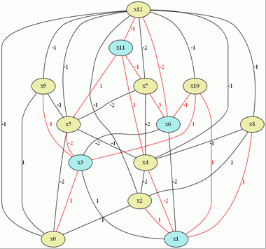

# Prime2Ising

素因数分解から帰着した落とし戸付きのイジング模型のハミルトニアンを計算します。

FACTORING -> Circuit SAT -> MAXSAT -> QUBO -> MAXCUT -> Ising

の順に経由して二体相互作用のみのハミルトニアンをO(n^2)で作ります。
FACTORINGからC-SATへの帰着は工夫するとより効率的にできて、nlognぐらいになるそうです。
http://jglobal.jst.go.jp/public/20090422/200902188354791090
や
https://ja.wikipedia.org/wiki/%E3%82%AB%E3%83%A9%E3%83%84%E3%83%90%E6%B3%95
などが知られているようです。

4=2*2を変換したising

